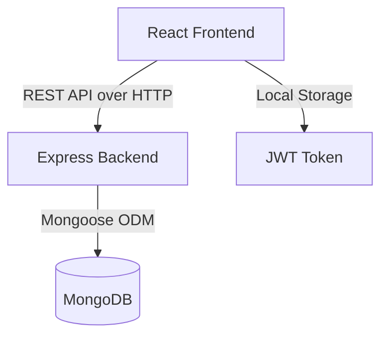
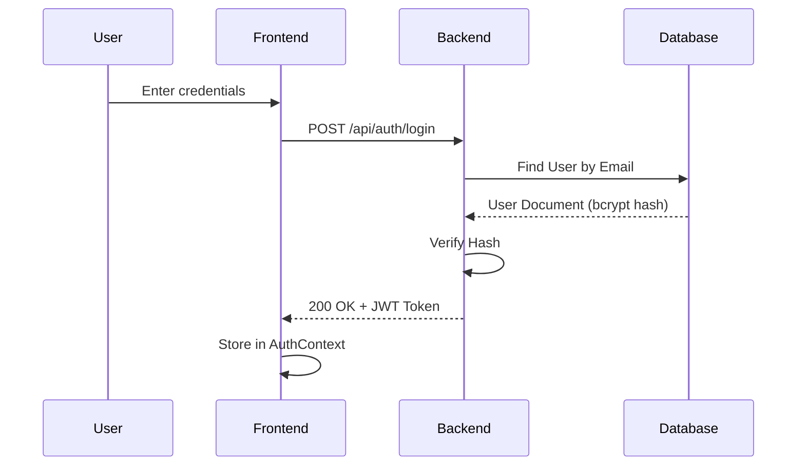
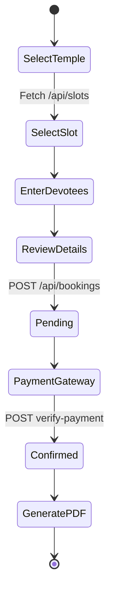
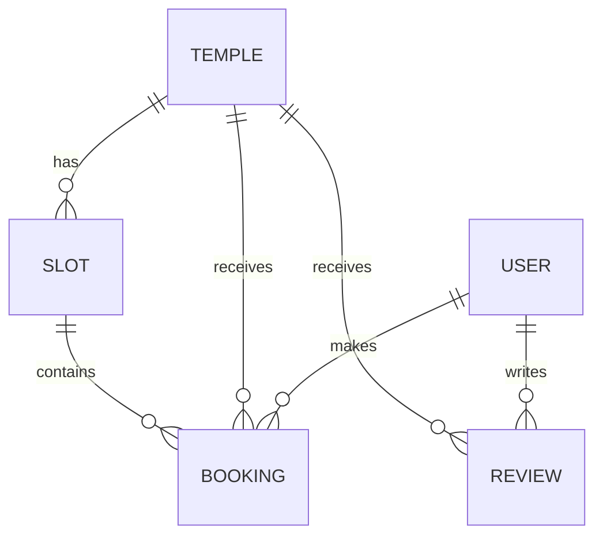
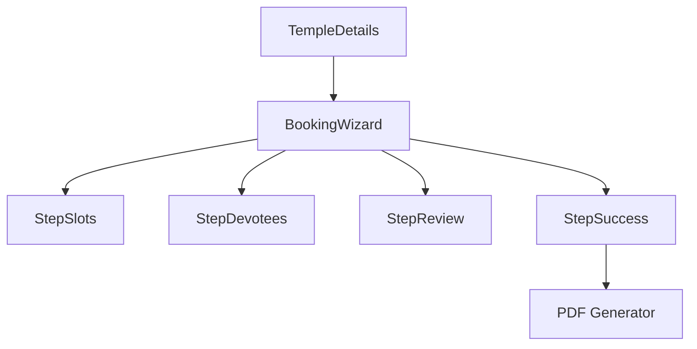
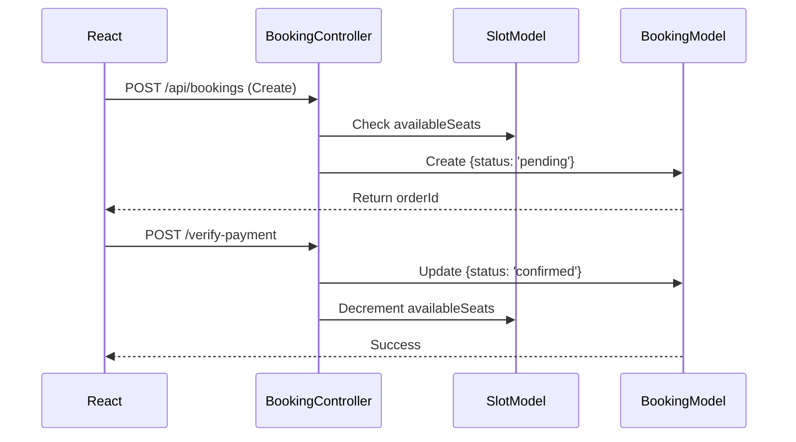
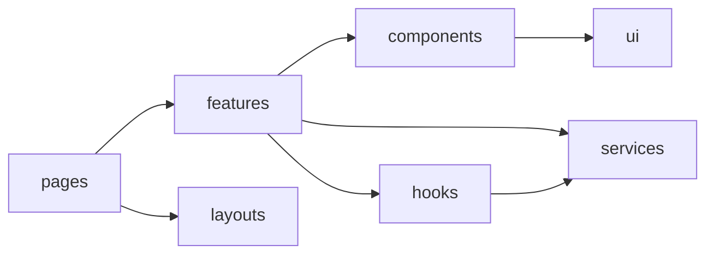

# DarshanEase - Project Analysis Report

## 1. Project Overview
- **Project Name**: DarshanEase
- **Purpose**: A comprehensive MERN-stack platform for booking temple Darshan slots, designed to eliminate long queues and streamline the devotee experience.
- **Main Features**: Temple browsing, slot availability viewing, multi-step booking wizard, secure checkout mock, PDF ticket generation, and an administrative dashboard for managing temples, slots, and bookings.
- **User Roles**: 
  - `user`: Standard devotee who can book slots and leave reviews.
  - `admin`/`organizer`: Elevated roles with access to the dashboard to manage system resources.
- **Technologies Used**: MongoDB, Express.js, React 19, Node.js, Vite, Tailwind CSS 4, React Router DOM, JS PDF, Framer Motion.

## 2. Folder Structure
```text
D:\Project
├── client/
│   ├── public/         (Static assets and favicon)
│   ├── src/
│   │   ├── api/        (Axios instance configurations)
│   │   ├── assets/     (Local images including downloaded real temple photographs)
│   │   ├── components/ (Shared UI and layout components like Navbar)
│   │   ├── context/    (React Context API providers e.g., AuthContext)
│   │   ├── features/   (Feature-based modules for Auth, Booking, Temple)
│   │   ├── hooks/      (Global custom hooks e.g., useBookings, useAdmin)
│   │   ├── layouts/    (Page wrapper layouts like AdminLayout)
│   │   ├── pages/      (Top-level page components/routes)
│   │   ├── services/   (API call abstractions)
│   │   ├── utils/      (Helper functions e.g., generatePDF)
│   │   ├── App.jsx     (Root application component and router configuration)
│   │   └── main.jsx    (React DOM entry point)
│   └── package.json    (Frontend dependencies and build scripts)
└── server/
    ├── config/         (Database configuration)
    ├── controllers/    (Express route handlers)
    ├── data/           (Seed data JSON files)
    ├── middleware/     (Express middlewares for Auth, Error handling)
    ├── models/         (Mongoose schemas)
    ├── routes/         (Express API routing definitions)
    ├── services/       (Backend business logic)
    ├── utils/          (Helper functions e.g., generateToken)
    ├── server.js       (Express application entry point)
    ├── seeder.js       (Database seeding script)
    └── package.json    (Backend dependencies)
```
- **client/src/features**: Groups components, hooks, and utilities logically by domain (e.g., booking) rather than by type, improving modularity.
- **server/controllers**: Contains the core business logic handling HTTP requests, keeping routes clean.

## 3. Frontend Architecture

### Pages
- `Home.jsx`: Landing page featuring hero banner, featured temples, and 'Why Choose Us'.
- `TempleList.jsx`: Search and filter catalog of all temples.
- `TempleDetails.jsx`: Detailed view of a single temple, showcasing images, history, reviews, and the booking trigger.
- `Dashboard.jsx`: User's personal dashboard to view past and upcoming bookings.
- `Login.jsx` / `Register.jsx`: Authentication pages.
- `AdminDashboard.jsx`, `AdminTemples.jsx`, `AdminBookings.jsx`: Administrative management views.

### Layouts
- `AdminLayout`: Wraps the admin pages with a persistent sidebar and top navigation specific to organizers.

### Feature Modules
- `features/booking/`: Contains the `BookingWizard`, `StepSlots`, `StepDevotees`, `StepReview`, and `StepSuccess` which encapsulate the complex multi-step state of making a reservation.

### Major Components
- **BookingWizard**
  - **Responsibility**: Orchestrates the multi-step booking process.
  - **Props**: `templeId`, `slots`, `isSlotsLoading`.
  - **State**: `step` (current step 1-4), `showPayment`, `pendingPayload`.
  - **APIs called**: Initiates `bookTemple` via `useBooking` hook.
- **TempleCard**
  - **Responsibility**: Displays a summary of a temple in grid lists.
  - **Props**: `temple` (object containing id, name, location, image).
  - **State**: None (Presentational).
- **StepSuccess**
  - **Responsibility**: Displays booking confirmation and provides PDF download.
  - **Props**: `bookingResult` (contains populated slot, devotee details, and order ID).
  - **APIs called**: Uses `utils/generatePDF.js` client-side, no direct API calls.

## 4. Backend Architecture

- **Routes**: `authRoutes.js`, `templeRoutes.js`, `bookingRoutes.js`, `slotRoutes.js`, `adminRoutes.js`, `reviewRoutes.js`. Defers to Controllers.
- **Controllers**:
  - `authController.js`: Handles user registration, login, and profile fetching.
  - `templeController.js`: Handles CRUD operations for Temple entities.
  - `bookingController.js`: Handles booking creation, payment verification (mock), and status updates.
  - `slotController.js`: Manages time slots, availability, and capacity constraints.
- **Models**: Defines the MongoDB schemas using Mongoose (`User`, `Temple`, `Booking`, `Slot`, `Review`).
- **Middleware**: 
  - `authMiddleware.js`: Verifies JWT tokens and checks `admin` roles.
  - `errorMiddleware.js`: Centralized error catching and formatting.
- **Services**: `adminService.js` (statistics aggregation), `NotificationService.js` (abstracted).

## 5. Database

All schemas are enforced via Mongoose.

### User Collection
- **Fields**: `name` (String), `email` (String), `password` (String), `role` (String, enum: `user`, `admin`, `organizer`).
- **Indexes**: `email` (unique).
- **Hooks**: `pre('save')` for bcrypt password hashing.

### Temple Collection
- **Fields**: `name`, `location`, `description`, `timings`, `history` (Strings), `featuredImage` (String).

### Slot Collection
- **Fields**: `templeId` (ObjectId, ref: Temple), `date` (Date), `time` (String), `capacity` (Number), `availableSeats` (Number), `type` (String: General, VIP).
- **Relationships**: Belongs to one Temple.

### Booking Collection
- **Fields**: `userId` (ObjectId, ref: User), `templeId` (ObjectId, ref: Temple), `slotId` (ObjectId, ref: Slot), `status` (Enum: pending, confirmed, cancelled), `paymentStatus` (Enum: pending, completed), `totalAmount` (Number), `devotees` (Array of objects).
- **Relationships**: Belongs to User, Temple, and Slot.

### Review Collection
- **Fields**: `userId` (ObjectId), `templeId` (ObjectId), `rating` (Number), `comment` (String).
- **Validation**: Rating must be between 1 and 5.

## 6. REST API Documentation

- **POST /api/auth/register**
  - **Desc**: Registers a new user. **Auth**: No.
  - **Body**: `{ name, email, password }`
  - **Response**: `201 Created` - `{ _id, name, email, token }`

- **POST /api/auth/login**
  - **Desc**: Authenticates a user. **Auth**: No.
  - **Body**: `{ email, password }`
  - **Response**: `200 OK` - `{ _id, name, email, role, token }`

- **GET /api/temples**
  - **Desc**: Fetches all temples. **Auth**: No.
  - **Response**: `200 OK` - Array of temple objects.

- **POST /api/bookings**
  - **Desc**: Creates a pending booking and reserves seats. **Auth**: Yes.
  - **Body**: `{ templeId, slotId, noOfPersons, devoteeDetails, totalAmount }`
  - **Response**: `201 Created` - Booking object including `orderId`.

- **POST /api/bookings/verify-payment**
  - **Desc**: Confirms payment and updates booking status to confirmed. **Auth**: Yes.
  - **Body**: `{ bookingId, paymentId }`
  - **Response**: `200 OK` - Confirmed booking object with populated `slotId`.

## 7. Authentication Flow
1. **Login**: Client submits credentials to `/api/auth/login`.
2. **JWT**: Server verifies bcrypt hash, signs a JWT with the user's `id`, and returns it.
3. **Storage**: Frontend `AuthContext` stores the token in `localStorage` and sets the Axios default Authorization header (`Bearer <token>`).
4. **Protected Routes**: The `protect` middleware intercepts requests, extracts the token, verifies it, and attaches `req.user`.
5. **Authorization**: Admin routes chain the `admin` middleware which checks if `req.user.role === 'admin'`.

## 8. Booking Flow
1. **Temple Selection**: User navigates to `TempleDetails.jsx` and clicks "Book Darshan".
2. **Slot Selection** (`StepSlots.jsx`): Fetches available slots for the temple. User selects a date and time.
3. **Devotee Details** (`StepDevotees.jsx`): User enters names, ages, and genders for the requested number of seats.
4. **Booking Creation** (`StepReview.jsx`): User confirms details. Frontend posts to `/api/bookings`. Backend temporarily holds seats and returns a pending booking ID.
5. **Payment**: `MockPaymentGateway.jsx` simulates processing.
6. **Verification**: Frontend sends success signal to `/api/bookings/verify-payment`.
7. **Seat Update**: Backend formally commits the reserved seats and changes status to `confirmed`.
8. **Ticket Generation** (`StepSuccess.jsx`): The populated booking data is converted into a stylized PDF using `jspdf` and `jspdf-autotable`, rendering a QR code generated by `qrcode.react`.

## 9. Admin Module
- **Dashboard**: Aggregates statistics via `useAdmin.js` hooked into `adminController.js`.
- **Temple Management**: CRUD interface for adding and updating temple details.
- **Slot Management**: Interface to generate time slots for specific temples and set capacities.
- **Booking Management**: Allows organizers to view all bookings across the platform.
- **User Management**: Allows admins to view registered users.

## 10. Frontend State Management
- **React Context**: `AuthContext` manages the global authentication state (user object, token, login/logout functions).
- **Local State**: Complex UI flows (like the Booking Wizard) use encapsulated React `useState` hooks to manage ephemeral data (current step, form inputs) before submitting to the server.
- **API Hooks**: Custom hooks (`useBooking`, `useSlots`, `useTemple`) abstract Axios calls and manage `isLoading` and `error` states, keeping components clean.

## 11. Component Relationships
- `App` -> `AuthContext.Provider` -> `BrowserRouter`
  - -> `Navbar`
  - -> `Routes`
    - -> `Home` -> `HomeHero`, `FeaturedTemples`, `WhyChooseUs`
    - -> `TempleDetails` -> `TempleHero`, `TempleInfo`, `BookingWizard`, `TempleReviews`
      - -> `BookingWizard` -> `StepSlots` OR `StepDevotees` OR `StepReview` OR `StepSuccess`

## 12. External Libraries
- **Frontend**:
  - `axios`: Promise-based HTTP client for API requests.
  - `tailwindcss`: Utility-first CSS framework for rapid UI styling.
  - `framer-motion`: Animation library for smooth page and component transitions.
  - `jspdf` & `jspdf-autotable`: Client-side PDF generation for Darshan tickets.
  - `react-hook-form`: Performant form validation.
  - `react-toastify`: Elegant push notifications for user feedback.
- **Backend**:
  - `express`: Fast, unopinionated web framework.
  - `mongoose`: Elegant MongoDB object modeling.
  - `jsonwebtoken` & `bcryptjs`: Secure authentication and password hashing.
  - `helmet` & `xss-clean`: Security middlewares to protect against vulnerabilities.

## 13. Environment Variables
- `PORT`: The port the backend server runs on (default: 5000).
- `MONGO_URI`: The MongoDB connection string.
- `JWT_SECRET`: The secret key used to sign and verify JSON Web Tokens.
- `NODE_ENV`: Defines the environment (development/production).

## 14. Build Instructions
- **Database**: Ensure MongoDB is running locally or via Atlas.
- **Backend Startup**: 
  1. `cd server`
  2. `npm install`
  3. `npm run dev` (Starts on port 5000)
- **Frontend Startup**:
  1. `cd client`
  2. `npm install`
  3. `npm run dev` (Starts Vite server on port 5173)
- **Seeder**: Run `node seeder.js` in the server directory to populate the database with default temples, slots, reviews, and admin users.

## 15. Known Limitations
- Payment processing is entirely mocked via `MockPaymentGateway.jsx`. It does not connect to a real PSP like Razorpay (though razorpay is in package.json, it is not fully implemented on the frontend).
- Concurrency issues during booking: If two users book the exact same final slot simultaneously, the seat constraint checking in the controller could result in race conditions without database-level transactions or locks.
- Real-time slot updates are not implemented (requires WebSockets/Socket.io).

## 16. Future Enhancements
- Implement pessimistic locking or MongoDB transactions during the booking slot decrement process.
- Integrate actual Razorpay checkout modal on the frontend instead of the mock gateway.
- Add Socket.io for real-time countdowns of available seats in the `StepSlots` UI.
- Implement pagination for the Temple List and Reviews endpoints to handle large datasets.

## 17. Screens
- Landing Page (`/`)
- Temple Search (`/temples`)
- Temple Details & Booking (`/temples/:id`)
- User Dashboard (`/dashboard`)
- Login (`/login`)
- Register (`/register`)
- Admin Overview (`/admin`)
- Admin Temples (`/admin/temples`)
- Admin Slots (`/admin/slots`)
- Admin Bookings (`/admin/bookings`)

## 18. Complete Route List
- **Frontend**:
  - Public: `/`, `/login`, `/register`, `/temples`, `/temples/:id`
  - Protected (User): `/dashboard`
  - Protected (Admin): `/admin`, `/admin/temples`, `/admin/slots`, `/admin/bookings`, `/admin/users`
- **Backend**:
  - `POST /api/auth/register`, `POST /api/auth/login`, `GET /api/auth/me`
  - `GET /api/temples`, `GET /api/temples/:id`, `POST /api/temples`
  - `GET /api/slots/temple/:templeId`, `POST /api/slots`
  - `POST /api/bookings`, `POST /api/bookings/verify-payment`, `GET /api/bookings/user`
  - `GET /api/reviews/temple/:templeId`

## 19. Code Statistics
- **Approximate lines of code**: 7,517 lines
- **Number of React Components**: 61
- **Number of API Endpoints**: ~20
- **Number of Models**: 5
- **Number of Contexts**: 1
- **Number of Hooks**: 10
- **Number of Pages**: 15
- **Number of Feature Modules**: 3 (Auth, Booking, Temple)

## 20. Mermaid Diagrams

### System Architecture


### Authentication Flow


### Booking Flow


### Database Relationships


### Component Flow


### API Flow (Booking)


### Folder Dependency Diagram

