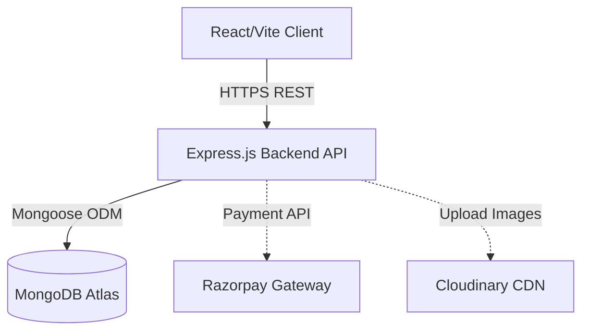
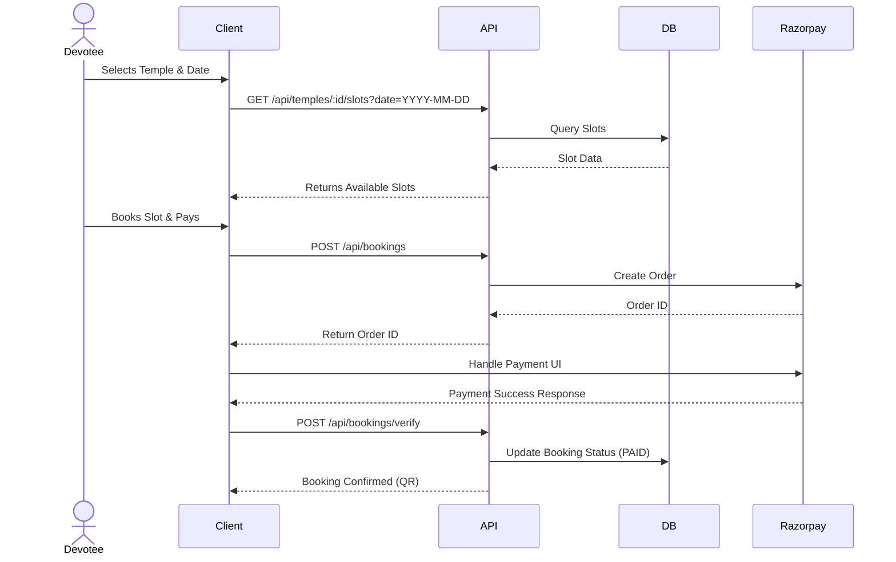

# Solution Architecture

## Overview
DarshanEase uses a standard 3-tier architecture (MERN stack).

```mermaid
graph TD
    Client[React/Vite Client] -->|HTTPS REST| API[Express.js Backend API]
    API -->|Mongoose ODM| DB[(MongoDB Atlas)]
    
    API -.->|Payment API| Razorpay[Razorpay Gateway]
    API -.->|Upload Images| Cloudinary[Cloudinary CDN]
```

## Data Flow

```mermaid
sequenceDiagram
    actor Devotee
    Devotee->>Client: Selects Temple & Date
    Client->>API: GET /api/temples/:id/slots?date=YYYY-MM-DD
    API->>DB: Query Slots
    DB-->>API: Slot Data
    API-->>Client: Returns Available Slots
    Devotee->>Client: Books Slot & Pays
    Client->>API: POST /api/bookings
    API->>Razorpay: Create Order
    Razorpay-->>API: Order ID
    API-->>Client: Return Order ID
    Client->>Razorpay: Handle Payment UI
    Razorpay-->>Client: Payment Success Response
    Client->>API: POST /api/bookings/verify
    API->>DB: Update Booking Status (PAID)
    API-->>Client: Booking Confirmed (QR)
```
