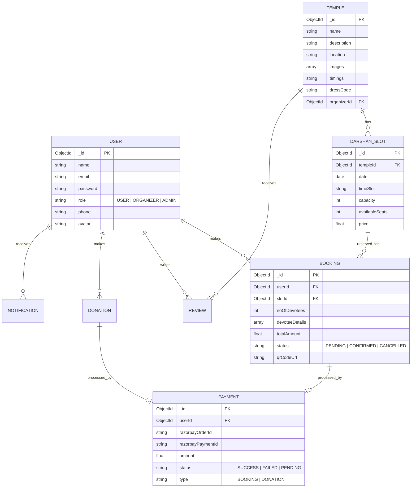

# Entity Relationship Diagram

```mermaid
erDiagram
    USER ||--o{ BOOKING : makes
    USER ||--o{ REVIEW : writes
    USER ||--o{ DONATION : makes
    USER ||--o{ NOTIFICATION : receives
    TEMPLE ||--o{ DARSHAN_SLOT : has
    TEMPLE ||--o{ REVIEW : receives
    DARSHAN_SLOT ||--o{ BOOKING : reserved_for
    BOOKING ||--o| PAYMENT : processed_by
    DONATION ||--o| PAYMENT : processed_by

    USER {
        ObjectId _id PK
        string name
        string email
        string password
        string role "USER | ORGANIZER | ADMIN"
        string phone
        string avatar
    }

    TEMPLE {
        ObjectId _id PK
        string name
        string description
        string location
        array images
        string timings
        string dressCode
        ObjectId organizerId FK
    }

    DARSHAN_SLOT {
        ObjectId _id PK
        ObjectId templeId FK
        date date
        string timeSlot
        int capacity
        int availableSeats
        float price
    }

    BOOKING {
        ObjectId _id PK
        ObjectId userId FK
        ObjectId slotId FK
        int noOfDevotees
        array devoteeDetails
        float totalAmount
        string status "PENDING | CONFIRMED | CANCELLED"
        string qrCodeUrl
    }

    PAYMENT {
        ObjectId _id PK
        ObjectId userId FK
        string razorpayOrderId
        string razorpayPaymentId
        float amount
        string status "SUCCESS | FAILED | PENDING"
        string type "BOOKING | DONATION"
    }
```
